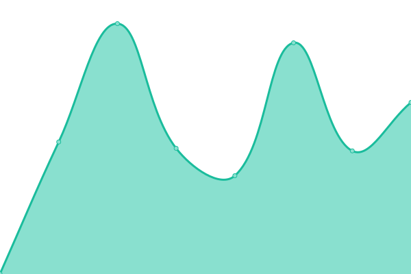

# [📈 Live Status](https://youknowblom.github.io/d-sektionen-upptime): <!--live status--> **🟧 Partial outage**

This repository contains the open-source uptime monitor and status page for [Andreas B](https://youknowblom.github.io/d-sektionen-upptime), powered by [Upptime](https://github.com/upptime/upptime).

With [Upptime](https://upptime.js.org), you can get your own unlimited and free uptime monitor and status page, powered entirely by a GitHub repository. We use [Issues](https://github.com/youknowblom/d-sektionen-upptime/issues) as incident reports, [Actions](https://github.com/youknowblom/d-sektionen-upptime/actions) as uptime monitors, and [Pages](https://youknowblom.github.io/d-sektionen-upptime) for the status page.

<!--start: status pages-->
<!-- This summary is generated by Upptime (https://github.com/upptime/upptime) -->
<!-- Do not edit this manually, your changes will be overwritten -->
<!-- prettier-ignore -->
| URL | Status | History | Response Time | Uptime |
| --- | ------ | ------- | ------------- | ------ |
|  [Medlemstjänster - Backend](https://backend.d-sektionen.se/tools/status) | 🟥 Down | [medlemstjaenster-backend.yml](https://github.com/YouKnowBlom/d-sektionen-upptime/commits/HEAD/history/medlemstjaenster-backend.yml) | 

 1058ms
     
 | 

<a href="https://youknowblom.github.io/d-sektionen-upptime/history/medlemstjaenster-backend">100.00%</a>
    

|  [Medlemstjänster - Frontend](https://medlem.d-sektionen.se) | 🟩 Up | [medlemstjaenster-frontend.yml](https://github.com/YouKnowBlom/d-sektionen-upptime/commits/HEAD/history/medlemstjaenster-frontend.yml) | 

 153ms
     
 | 

<a href="https://youknowblom.github.io/d-sektionen-upptime/history/medlemstjaenster-frontend">100.00%</a>
    

|  [Hemsida](https://d-sektionen.se) | 🟩 Up | [hemsida.yml](https://github.com/YouKnowBlom/d-sektionen-upptime/commits/HEAD/history/hemsida.yml) | 

 1438ms
     
 | 

<a href="https://youknowblom.github.io/d-sektionen-upptime/history/hemsida">100.00%</a>
    

|  [Lysator](lysator.liu.se) | 🟩 Up | [lysator.yml](https://github.com/YouKnowBlom/d-sektionen-upptime/commits/HEAD/history/lysator.yml) | 

 1798ms
     
 | 

<a href="https://youknowblom.github.io/d-sektionen-upptime/history/lysator">99.75%</a>
    

<!--end: status pages-->

[**Visit our status website →**](https://youknowblom.github.io/d-sektionen-upptime)

## 📄 License

- Powered by: [Upptime](https://github.com/upptime/upptime)
- Code: [MIT](./LICENSE) © [Anand Chowdhary](https://anandchowdhary.com), supported by [Pabio](https://pabio.com)
- Data in the `./history` directory: [Open Database License](https://opendatacommons.org/licenses/odbl/1-0/)
